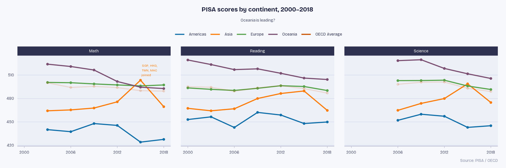
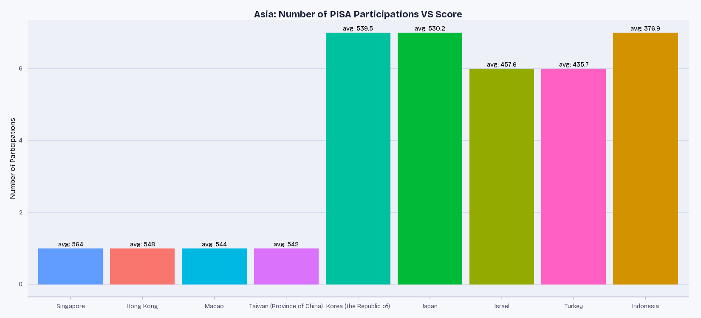
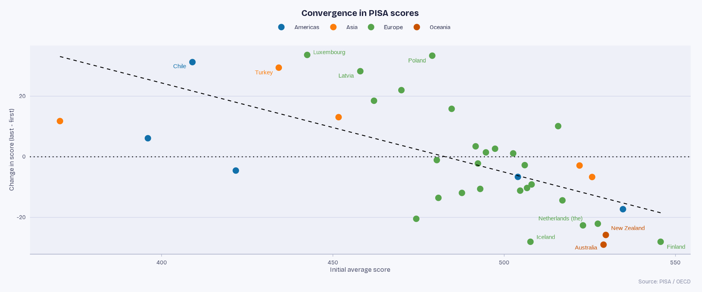
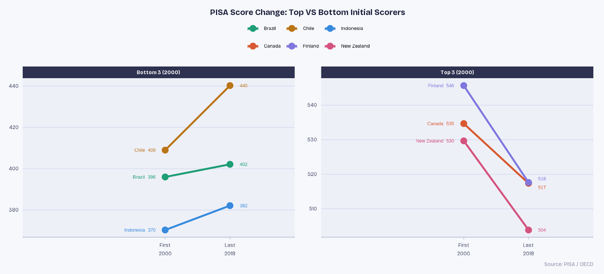
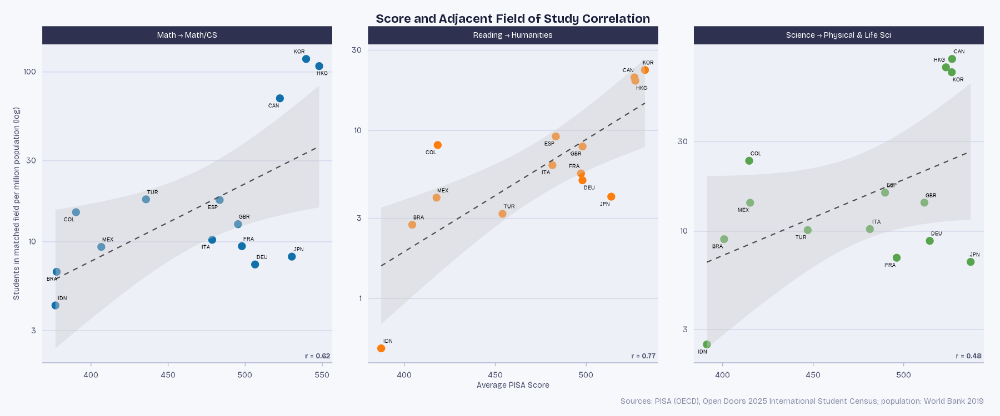
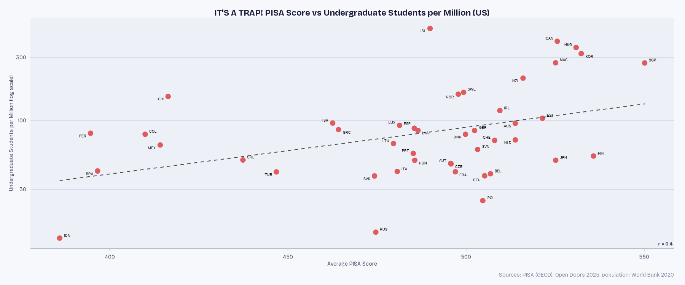
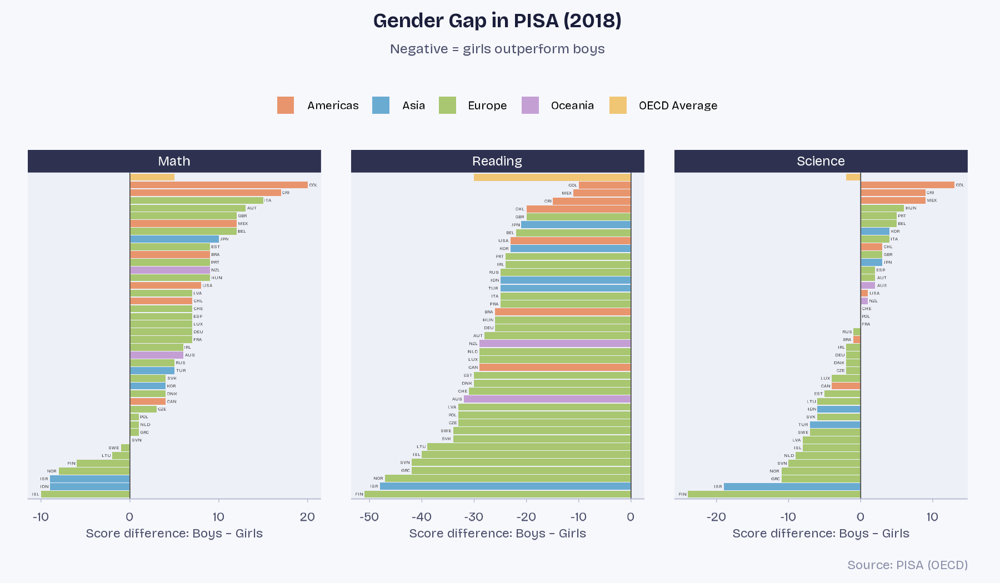

```{=html}
<style>
@import url('https://fonts.googleapis.com/css2?family=Bricolage+Grotesque:opsz,wght@12..96,300;12..96,400;12..96,600;12..96,700&display=swap');

body {
  font-family: 'Bricolage Grotesque', sans-serif;
  color: #2E3250;
  line-height: 1.7;
}

h1, h2, h3 {
  color: #1A1E3A;
  font-weight: 700;
}

.callout-note {
  border-left-color: #1170AA;
}

.callout-tip {
  border-left-color: #57A44C;
}

.callout-warning {
  border-left-color: #FC7D0B;
}

.callout-important {
  border-left-color: #C85200;
}

.lead {
  font-size: 0.7 rem;
  color: #4A4E6A;
  font-weight: 300;
}

.insight-box {
  background: #EEF0F8;
  border-left: 4px solid #1170AA;
  padding: 1rem 1.25rem;
  border-radius: 0 6px 6px 0;
  margin: 1.5rem 0;
  font-size: 0.95rem;
}

.fig-caption {
  text-align: center;
  font-size: 0.85rem;
  color: #8A8FA8;
  font-style: italic;
  margin-top: 0.3rem;
  margin-bottom: 1.5rem;
}

.quarto-figure, figure, p > img {
  max-width: 100%;
  overflow: hidden;
}
</style>
```

```{r setup}
#| label: setup
#| include: false
#| eval: false

library(tidyverse)
library(giscoR)
library(readxl)
library(countrycode)
library(ggrepel)
library(WDI)
library(patchwork)
library(showtext)
library(ggtext)

font_add_google("Bricolage Grotesque", "bricolage")
showtext_auto()

# 10-color palette — distinct, colour-blind-friendly, reusable for any data
cb10 <- c(
  "#1170AA", "#FC7D0B", "#57A44C", "#C85200",
  "#7B4F71", "#00928F", "#D4A017", "#5FA2CE", "#E05C5C", "#A3ACB9"
)

theme_custom <- function(base_size = 12, base_family = "bricolage") {
  theme_minimal(base_size = base_size, base_family = base_family) %+replace%
    theme(
      plot.background    = element_rect(fill = "#F7F8FC", colour = NA),
      panel.background   = element_rect(fill = "#EEF0F8", colour = NA),
      panel.grid.major.y = element_line(colour = "#D4D8EB", linewidth = 0.35),
      panel.grid.major.x = element_blank(),
      panel.grid.minor   = element_blank(),
      panel.border       = element_blank(),
      axis.line.x        = element_line(colour = "#B0B5CC", linewidth = 0.4),
      axis.line.y        = element_blank(),
      strip.background   = element_rect(fill = "#2E3250", colour = NA),
      strip.text         = element_text(
        family = base_family, size = rel(0.90),
        colour = "#FFFFFF", face = "plain", margin = margin(5, 0, 5, 0)
      ),
      axis.text          = element_text(size = rel(0.85), colour = "#4A4E6A"),
      axis.title         = element_blank(),
      axis.ticks.x       = element_line(colour = "#B0B5CC", linewidth = 0.3),
      axis.ticks.y       = element_blank(),
      axis.ticks.length  = unit(3, "pt"),
      legend.position    = "top",
      panel.spacing      = unit(1.2, "lines"),
      plot.title         = element_text(
        size = rel(1.35), face = "bold", colour = "#1A1E3A", margin = margin(b = 2)
      ),
      plot.subtitle      = element_text(
        size = rel(0.92), colour = "#4A4E6A", margin = margin(b = 12)
      ),
      plot.caption       = element_text(
        size = rel(0.85), colour = "#8A8FA8", hjust = 1, margin = margin(t = 8)
      ),
      plot.margin        = margin(12, 14, 10, 12)
    )
}
```

------------------------------------------------------------------------

::: lead
Every three years, the OECD tests half a million 15-year-olds across dozens of countries in math, reading, and science. The result is PISA — arguably the most comprehensive snapshot of what the world's students can do. This report digs into six rounds of that data, from 2000 to 2018, to ask: *who is improving, who is falling behind, and does any of it actually matter downstream?*
:::

------------------------------------------------------------------------

## Data & Setup

The analysis draws on three OECD PISA datasets (math, reading, science) merged with geographic metadata, international student enrollment figures from *Open Doors 2025*, and World Bank population estimates. Each row represents an individual student.

```{r load-data}
#| label: load-data

# math scores — note: starts at 2003
pisamath <- read_csv("data/pisamath.csv")

data("gisco_countrycode")

pisamath_reg <- pisamath |>
  select(LOCATION, SUBJECT, TIME, Value) |>
  left_join(
    gisco_countrycode |> select(ISO3_CODE, continent, country = iso.name.en),
    by = c("LOCATION" = "ISO3_CODE")
  ) |>
  mutate(continent = case_when(
    LOCATION == "OAVG" ~ "OECD Average",
    TRUE ~ continent
  )) |>
  select(-LOCATION)

# reading scores — note: starts at 2000
pisareading <- read_csv("data/pisareading.csv")

pisareading_reg <- pisareading |>
  select(LOCATION, SUBJECT, TIME, Value) |>
  left_join(
    gisco_countrycode |> select(ISO3_CODE, continent, country = iso.name.en),
    by = c("LOCATION" = "ISO3_CODE")
  ) |>
  mutate(continent = case_when(
    LOCATION == "OAVG" ~ "OECD Average",
    TRUE ~ continent
  )) |>
  select(-LOCATION)

# science scores — note: starts at 2006
pisascience <- read_csv("data/pisascience.csv")

pisascience_reg <- pisascience |>
  select(LOCATION, SUBJECT, TIME, Value) |>
  left_join(
    gisco_countrycode |> select(ISO3_CODE, continent, country = iso.name.en),
    by = c("LOCATION" = "ISO3_CODE")
  ) |>
  mutate(continent = case_when(
    LOCATION == "OAVG" ~ "OECD Average",
    TRUE ~ continent
  )) |>
  select(-LOCATION)

# united tibble
pisa_wide <- pisamath_reg |>
  select(country, continent, SUBJECT, TIME, math_score = Value) |>
  full_join(
    pisareading_reg |> select(country, continent, SUBJECT, TIME, reading_score = Value),
    by = c("country", "continent", "TIME", "SUBJECT")
  ) |>
  full_join(
    pisascience_reg |> select(country, continent, SUBJECT, TIME, science_score = Value),
    by = c("country", "continent", "TIME", "SUBJECT")
  )
```

------------------------------------------------------------------------

## 1. The Global Picture

### Hypothesis

*Does educational performance differ systematically by continent, and has it been converging or diverging over time?*


```{r continent-trends}
#| label: continent-trends
#| fig-height: 4.5
#| fig-cap: "Average PISA score by continent and subject, 2000–2018. The OECD average is faded; Asia's 2015 spike is annotated."

pisa_long <- pisa_wide |>
  pivot_longer(cols = c(math_score, reading_score, science_score),
               names_to = "subject", values_to = "score") |>
  group_by(continent, TIME, subject) |>
  summarise(avg_score = mean(score, na.rm = TRUE), .groups = "drop")

my_colours <- cb10[1:5]
names(my_colours) <- c("Americas", "Asia", "Europe", "OECD Average", "Oceania")

asia_spike_label <- tibble(
  subject = c("math_score", "reading_score", "science_score"),
  TIME = 2015,
  avg_score = c(516, 494, 508),
  label = c("SGP, HKG,\nTWN, MAC\njoined", "", "")
)

ggplot(pisa_long, aes(TIME, avg_score, colour = continent, alpha = continent)) +
  geom_line(linewidth = 0.9) +
  geom_point(aes(alpha = continent), size = 1.4, show.legend = FALSE) +
  geom_text(
    data = asia_spike_label,
    aes(x = TIME, y = avg_score, label = label),
    colour = "#FC7D0B", size = 2.8, lineheight = 0.85,
    hjust = -0.1, inherit.aes = FALSE
  ) +
  facet_wrap(~subject, nrow = 1,
             labeller = as_labeller(c(
               math_score = "Math",
               reading_score = "Reading",
               science_score = "Science"
             ))) +
  scale_colour_manual(values = my_colours) +
  scale_alpha_manual(
    values = c(Americas = 1, Asia = 1, Europe = 1,
               Oceania = 1, "OECD Average" = 0.15),
    guide = "none"
  ) +
  scale_x_continuous(breaks = seq(2000, 2018, 6)) +
  labs(
    title = "PISA scores by continent, 2000–2018",
    subtitle = "Oceania is leading?",
    caption = "Source: PISA / OECD",
    colour = NULL
  ) +
  theme_custom() +
  theme(
    plot.subtitle = ggtext::element_markdown(size = rel(0.85), colour = "#4A4E6A",
                                                hjust = 0.5, margin = margin(b = 12, t = 10)),
    legend.position = "top",
    legend.direction = "horizontal",
    legend.text = element_text(size = rel(0.85), colour = "#2E3250"),
    legend.key.width = unit(20, "pt"),
    legend.key.height = unit(2, "pt"),
    legend.spacing.x = unit(6, "pt")
  )
```

:::: {.column-screen-inset}

::::

::: {.fig-caption}
fig. 1.1 Pisa Scores by Continent Over Time
:::


::: callout-note
### Why does Oceania look so strong?

`Oceania` in this dataset consists entirely of **Australia and New Zealand** — two wealthy, English-speaking OECD members. Less developed Pacific island nations do not participate in PISA. This is a structural bias: the regions that look best are often those where the lower-performing countries simply aren't in the room. India, for instance, has never participated at the national level.
:::

### The Asia Spike — A Sampling Story

Asia's dramatic jump in 2015 is not an educational miracle. It is an artefact of who showed up.

```{r asia-participation}
#| label: asia-participation
#| fig-height: 5
#| fig-cap: "Asian PISA participants: number of rounds attended vs. average score across all subjects."

avg_scores <- pisa_wide |>
  filter(continent == "Asia") |>
  group_by(country) |>
  summarise(avg_score = round(mean(math_score, na.rm = TRUE), 1), .groups = "drop")

pisa_asian_countries <- pisa_wide |>
  filter(continent == "Asia") |>
  distinct(country, TIME) |>
  count(country, name = "N_participations") |>
  left_join(avg_scores, by = "country")

ggplot(pisa_asian_countries,
       aes(x = reorder(country, -avg_score), y = N_participations, fill = country)) +
  geom_col(show.legend = FALSE) +
  geom_text(aes(label = paste0("avg: ", avg_score)), vjust = -0.5, size = 4) +
  labs(
    title = "Asia: Number of PISA Participations VS Score",
    x = "Country",
    y = "Number of Participations"
  ) +
  theme_custom() +
  theme(axis.title.y = element_text())
```

:::: {.column-screen-inset}

::::

::: {.fig-caption}
fig. 1.2 Asian Participants VS Score
:::

Singapore (avg: 564), Hong Kong (548), Macao (544), and Taiwan (542) — the top-scoring Asian economies — each participated in **only one round**, joining in 2015. When those city-state powerhouses are included, the continental average soars. When they drop out, it falls back. The score change is entirely compositional, not behavioural.

*Perhaps, if high-scoring countries participated steadily, as well as those that never joined, Asia could be the leading continent.*

------------------------------------------------------------------------

## 2. Convergence: Are Countries Catching Up?

### Hypothesis

*Do countries that started with low scores improve over time, while early high-scorers stagnate or decline?*

This is the convergence hypothesis, borrowed from growth economics: if educational quality has diminishing returns to existing investment, those behind should have more room to improve.

```{r convergence}
#| label: convergence
#| fig-height: 5
#| fig-cap: "Score change (last minus first participation) vs. initial score. Labelled countries are the top and bottom 5 movers."

pisa_country <- pisa_wide |>
  pivot_longer(cols = c(math_score, reading_score, science_score),
               names_to = "subject", values_to = "score") |>
  group_by(country, continent, TIME) |>
  summarise(avg_score = mean(score, na.rm = TRUE), .groups = "drop")

pisa_convergence <- pisa_country |>
  filter(!is.na(country)) |>
  group_by(country) |>
  filter(n_distinct(TIME) >= 3) |> #only countries participating more than 3 times
  ungroup() |>
  group_by(country, continent) |>
  summarise(
    first_score = avg_score[TIME == min(TIME)],
    last_score = avg_score[TIME == max(TIME)],
    .groups = "drop"
  ) |>
  mutate(change = last_score - first_score)

pisa_convergence |>
  ggplot(aes(first_score, change, colour = continent)) +
  geom_point(size = 3) +
  geom_smooth(method = "lm", se = FALSE, colour = "black",
              linetype = "dashed", linewidth = 0.5) +
  geom_hline(yintercept = 0, linetype = "dotted") +
  ggrepel::geom_text_repel(
    aes(label = ifelse(country %in% label_countries, country, "")),
    size = 4, max.overlaps = 15, box.padding = 0.4, segment.color = NA
  ) +
  labs(
    title = "Convergence in PISA scores",
    x = "Initial average score",
    y = "Change in score (last − first)",
    caption = "Source: PISA / OECD",
    colour = ""
  ) +
  scale_colour_manual(values = cb10) +
  theme_custom() +
  theme(
    legend.direction = "horizontal",
    legend.text = element_text(size = rel(0.95), colour = "#2E3250"),
    legend.key.width  = unit(20, "pt"),
    legend.key.height = unit(2, "pt"),
    legend.spacing.x = unit(6, "pt"),
    axis.title = element_text(size = rel(0.98), colour = "#4A4E6A")
  )
```

:::: {.column-screen-inset}

::::

::: {.fig-caption}
fig. 2.1 Convergence in PISA Scores
:::

The downward-sloping trend is clear: countries that started low improved; countries that started high declined or stagnated. But the outliers are where the story gets interesting.

**Top improvers:** Luxembourg, Poland, Chile, Turkey, Latvia

-   **Poland and Latvia** implemented  education reforms during this period
-   **Chile and Turkey** were among the fastest-growing economies in their regions; rising incomes and school enrollment rates likely contributed
-   **Luxembourg** is something of an outlier: its early scores were depressed by a highly multilingual student population taking the test in a foreign language

**Biggest decliners:** Finland, New Zealand, Australia, Iceland, the Netherlands — all wealthy, stable, long-established PISA participants. Whether this reflects genuine educational decline or regression to the mean after an exceptional early run is hard to disentangle.

### Who Moved Most?

```{r slope-chart}
#| label: slope-chart
#| fig-cap: "Score change from first to last PISA round for the three highest and lowest initial scorers."

top3 <- pisa_convergence |> arrange(desc(first_score)) |> slice_head(n = 3) |> pull(country)
bottom3 <- pisa_convergence |> arrange(first_score) |> slice_head(n = 3) |> pull(country)
# top3: Finland, Canada, New Zealand
# bottom3: Indonesia, Brazil, Chile

slope_colours <- c(
  "Finland" = "#7F77DD",
  "Canada" = "#D85A30",
  "New Zealand" = "#D4537E",
  "Indonesia" = "#378ADD",
  "Brazil" = "#1D9E75",
  "Chile" = "#BA7517"
)

slope_data <- pisa_convergence |>
  filter(country %in% c(top3, bottom3)) |>
  mutate(
    group = if_else(country %in% top3, "Top 3 (2000)", "Bottom 3 (2000)"),
    group = factor(group, levels = c("Bottom 3 (2000)", "Top 3 (2000)"))
  ) |>
  select(country, group, first_score, last_score) |>
  pivot_longer(c(first_score, last_score), names_to = "period", values_to = "score") |>
  mutate(period = factor(
    if_else(period == "first_score", "First\n2000", "Last\n2018"),
    levels = c("First\n2000", "Last\n2018")
  ))

slope_data |>
  ggplot(aes(period, score, colour = country, group = country)) +
  geom_line(linewidth = 1.2) +
  geom_point(size = 3.5) +
  ggrepel::geom_text_repel(
    data = \(d) filter(d, period == "First\n2000"),
    aes(label = paste0(country, "  ", round(score))),
    direction = "y", hjust = 1, nudge_x = -0.15, segment.color = NA, size = 3.4
  ) +
  ggrepel::geom_text_repel(
    data = \(d) filter(d, period == "Last\n2018"),
    aes(label = round(score)),
    direction = "y", hjust = 0, nudge_x = 0.15, segment.color = NA, size = 3.4
  ) +
  facet_wrap(~group, scales = "free_y") +
  scale_colour_manual(values = slope_colours, name = NULL) +
  scale_x_discrete(expand = expansion(add = c(2.2, 1.0))) +
  labs(
    title = "PISA Score Change: Top VS Bottom Initial Scorers",
    x = NULL,
    caption = "Source: PISA / OECD"
  ) +
  theme_custom() +
  theme(
    strip.background = element_rect(fill = "#2E3250", colour = NA),
    strip.text = element_text(colour = "white", face = "bold"),
    strip.placement = "outside"
  )
```

:::: {.column-screen-inset}

::::

::: {.fig-caption}
fig. 2.2 Top VS Bottom Inital Scorers Over Time
:::

The convergence is asymmetric in an important way: the bottom performers improved modestly, while the top performers fell sharply. The gap between the world's best and worst educated 15-year-olds has narrowed — but it remains very large in absolute terms.

------------------------------------------------------------------------

## 3. Does PISA Score Predict What Students Study?

### Hypothesis

*Countries where students score higher in a subject should produce more graduates in the adjacent field — if PISA measures something real about intellectual formation, not just test-taking.*

The adjacent fields are: **Math → Math/CS**, **Reading → Humanities**, **Science → Physical & Life Sciences**. Student counts come from the 2025 Open Doors international enrollment census, normalized per million population to control for country size.

```{r field-correlation}
#| label: field-correlation
#| fig-height: 5
#| fig-cap: "PISA average score vs. students enrolled in the matched US field of study per million population (log scale). Pearson r shown per panel."

fields <- read_excel("data/OD25_Intl-Student-Census_Tables.xlsx", sheet = "5", skip = 3) |>
  set_names(c("country", "total", "business", "education", "engineering",
              "fine_arts", "health", "humanities", "intensive_english",
              "math_cs", "physical_life_sciences", "social_sciences",
              "other", "undeclared")) |>
  filter(!is.na(total), !str_detect(country, "^\\*|^Note")) |>
  mutate(
    across(total:undeclared, as.numeric),
    iso3c = countrycode(str_trim(country), "country.name", "iso3c"),
    n_math_cs = total * math_cs / 100,
    n_physical_sciences = total * physical_life_sciences / 100,
    n_humanities = total * humanities / 100
  ) |>
  select(iso3c, total, n_math_cs, n_physical_sciences, n_humanities)

pop <- WDI(indicator = "SP.POP.TOTL", start = 2019, end = 2019, extra = TRUE) |>
  filter(!is.na(iso3c)) |>
  transmute(iso3c, pop_millions = SP.POP.TOTL / 1e6)

dat <- pisa |>
  inner_join(fields, by = "iso3c") |>
  inner_join(pop, by = "iso3c") |>
  mutate(
    n_stem_field = case_when(
      subject == "math"    ~ n_math_cs,
      subject == "science" ~ n_physical_sciences,
      subject == "reading" ~ n_humanities
    ),
    students_per_million = n_stem_field / pop_millions,
    subject_label = case_when(
      subject == "math"    ~ "Math → Math/CS",
      subject == "science" ~ "Science → Physical & Life Sci",
      subject == "reading" ~ "Reading → Humanities"
    )
  )

cor_labels <- dat |>
  group_by(subject_label) |>
  summarise(
    r = cor(avg_score, log10(students_per_million), use = "complete.obs"),
    .groups = "drop"
  ) |>
  mutate(label = paste0("r = ", round(r, 2)))

ggplot(dat, aes(avg_score, students_per_million)) +
  geom_point(aes(colour = subject), size = 2.5, show.legend = FALSE) +
  geom_smooth(method = "lm", se = TRUE, colour = "grey30",
              fill = "grey80", linetype = "dashed", linewidth = 0.5) +
  geom_text_repel(aes(label = iso3c), size = 2.5, max.overlaps = 20, segment.color = NA) +
  geom_text(
    data = cor_labels,
    aes(label = label),
    x = Inf, y = -Inf, hjust = 1.1, vjust = -1,
    size = 3.2, colour = "#4A4E6A", fontface = "bold", inherit.aes = FALSE
  ) +
  facet_wrap(~subject_label, scales = "free") +
  scale_y_log10(labels = scales::comma) +
  scale_colour_manual(values = cb10) +
  labs(
    title = "Score and Adjacent Field of Study Correlation",
    x = "Average PISA Score",
    y = "Students in matched field per million population (log)",
    caption = "Sources: PISA (OECD), Open Doors 2025 International Student Census; population: World Bank 2019"
  ) +
  theme_custom() +
  theme(axis.title = element_text(size = rel(0.88), colour = "#4A4E6A"))
```

:::: {.column-screen-inset}

::::

::: {.fig-caption}
fig. 3.1 Score And Field of Study Correlation
:::

The strongest signal is in **Reading → Humanities** : countries where teenagers read well send substantially more students to humanities programs in the US.

::: callout-warning
### Causation caution

This is not evidence that PISA scores *cause* field selection. Wealthier countries both score higher and send more students abroad — GDP is almost certainly a dominant factor. And this dataset only captures students studying in the **United States**; many European countries preferentially send students to the UK or France, which would suppress their apparent counts here.
:::

------------------------------------------------------------------------

## 4. Does PISA Predict Total Enrollment Abroad?

### Hypothesis

*If PISA captures genuine human capital, countries with higher scores should send more students abroad overall — not just into matched fields.*

```{r undergrad-correlation}
#| label: undergrad-correlation
#| fig-height: 5.5
#| fig-cap: "Average PISA score vs. total undergraduate students sent to the US per million population. Note the wide scatter — this is a trap."

pisa_avg <- bind_rows(
  pisamath_reg |> select(country, Value),
  pisareading_reg |> select(country, Value),
  pisascience_reg |> select(country, Value)
) |>
  summarise(avg_pisa_score = mean(Value, na.rm = TRUE), .by = country) |>
  mutate(iso3c = countrycode(country, "country.name", "iso3c"))

students <- read_excel("data/OD25_Intl-Student-Census_Tables.xlsx", sheet = "8", skip = 5) |>
  select(code = 1, country = 2, N_Students = 6) |>
  mutate(across(c(code, N_Students), as.numeric)) |>
  filter(!is.na(code), !is.na(country), code %% 100 != 0,
         !code %in% c(3999, 4999), N_Students > 0) |>
  mutate(iso3c = countrycode(country, "country.name", "iso3c")) |>
  select(iso3c, N_Students)

population <- WDI(country = "all", indicator = "SP.POP.TOTL", start = 2020, end = 2020) |>
  select(iso3c, population = SP.POP.TOTL)

pisa_avg |>
  inner_join(students, by = "iso3c") |>
  inner_join(pop, by = "iso3c") |>
  filter(iso3c != "USA") |>
  mutate(students_per_million = N_Students / pop_millions) |>
  ggplot(aes(avg_pisa_score, students_per_million)) +
  geom_point(size = 2.5, colour = cb10[9]) +
  geom_smooth(method = "lm", se = FALSE, colour = "grey30",
              linetype = "dashed", linewidth = 0.5) +
  geom_text_repel(aes(label = iso3c), size = 2.5, max.overlaps = 20, segment.color = NA) +
  geom_text(
    aes(label = paste0("r = ", round(cor(avg_pisa_score, log10(students_per_million)), 2))),
    x = Inf, y = -Inf, hjust = 1.1, vjust = -1,
    size = 3.2, colour = "#4A4E6A", fontface = "bold", stat = "unique"
  ) +
  scale_y_log10(labels = scales::comma) +
  labs(
    title = "IT'S A TRAP! PISA Score vs Undergraduate Students per Million (US)",
    x = "Average PISA Score",
    y = "Undergraduate Students per Million (log scale)",
    caption = "Sources: PISA (OECD), Open Doors 2025; population: World Bank 2020"
  ) +
  theme_custom() +
  theme(axis.title = element_text(size = rel(0.88), colour = "#4A4E6A"))
```

:::: {.column-screen-inset}

::::

::: {.fig-caption}
fig. 4.1 Score VS Number of Students
:::

The correlation drops to **r = 0.4** — weaker than any of the subject-specific correlations, which is revealing. Iceland sends far more students to the US than its PISA score would predict; Germany, Japan, and Finland far fewer.

**Conclusion:** PISA explains *field choice* better than it explains *volume*. The decision to study abroad at all — and specifically in the US — is dominated by factors outside educational attainment: English language proficiency, family wealth, visa regimes, cultural ties, and the availability of domestic alternatives.

------------------------------------------------------------------------

## 5. The Gender Gap

### Hypothesis

*Do boys and girls perform differently across subjects, and is the pattern consistent globally?*

```{r gender-gap}
#| label: gender-gap
#| fig-height: 7
#| fig-cap: "Gender gap in PISA scores by subject, 2018. Negative values = girls outperform boys."

math_gap_2018 <- pisa_wide |>
  filter(!is.na(math_score), SUBJECT %in% c("BOY", "GIRL"), TIME == 2018) |>
  select(country, continent, SUBJECT, math_score) |>
  pivot_wider(names_from = SUBJECT, values_from = math_score) |>
  mutate(gap = BOY - GIRL, iso3c = countrycode(country, "country.name", "iso3c"),
         subject = "Math") |>
  filter(!is.na(gap)) |>
  arrange(gap) |>
  mutate(iso3c = fct_inorder(iso3c))

reading_gap_2018 <- pisa_wide |>
  filter(!is.na(reading_score), SUBJECT %in% c("BOY", "GIRL"), TIME == 2018) |>
  select(country, continent, SUBJECT, reading_score) |>
  pivot_wider(names_from = SUBJECT, values_from = reading_score) |>
  mutate(gap = BOY - GIRL, iso3c = countrycode(country, "country.name", "iso3c"),
         subject = "Reading") |>
  filter(!is.na(gap)) |>
  arrange(gap) |>
  mutate(iso3c = fct_inorder(iso3c))

science_gap_2018 <- pisa_wide |>
  filter(!is.na(science_score), SUBJECT %in% c("BOY", "GIRL"), TIME == 2018) |>
  select(country, continent, SUBJECT, science_score) |>
  pivot_wider(names_from = SUBJECT, values_from = science_score) |>
  mutate(gap = BOY - GIRL, iso3c = countrycode(country, "country.name", "iso3c"),
         subject = "Science") |>
  filter(!is.na(gap)) |>
  arrange(gap) |>
  mutate(iso3c = fct_inorder(iso3c))
```

:::: {.column-screen-inset}

::::

::: {.fig-caption}
fig. 5.1 Gender Gap
:::

**Math:** Boys lead almost everywhere. The gap is largest in Latin America and Southern Europe. Interestingly, girls outperform boys in a handful of Northern European countries — where gender equality norms are strongest.

**Reading:** Girls lead in *every single country*, often by more than boys lead in math. The leading explanation is developmental: girls acquire verbal skills earlier and read more for pleasure, and this holds regardless of cultural context. It is one of the most consistent findings in comparative education.

**Science:** Mixed. There is a slight average advantage for boys, but many gaps are close to zero, and the pattern is country-specific. There is no clean STEM story here.

::: callout-tip
### The asymmetry that gets overlooked

Public discourse focuses heavily on women in STEM and rarely on men in humanities. Both gaps are real, both deserve attention, and they likely have related underlying causes.
:::

------------------------------------------------------------------------

## Summary & Conclusions

| Question | Finding |
|------------------------------------|------------------------------------|
| **Who is performing best by continent?** | Oceania leads — but this reflects the absence of lower-income Pacific nations from the sample, not continental superiority. |
| **Is Asia really that good?** | The four top-scoring Asian economies (Singapore, Hong Kong, Macao, Taiwan) are genuine standouts. Their limited participation inflates the continental average in select years. |
| **Are low-scorers catching up?** | Yes, there is clear convergence. Low-scorers improved (Chile, Poland, Turkey, Latvia); high-scorers stagnated or declined (Finland, New Zealand, the Netherlands). |
| **Does PISA predict field choice?** | Moderately — especially for reading → humanities (r = 0.77). But wealth, language, and geography confound the relationship. |
| **Does PISA predict study-abroad volume?** | Weakly (r = 0.4). Scores explain *what* students study more than *whether* they study abroad. |
| **Are gender gaps universal?** | Girls' reading advantage is universal. Boys' math advantage is widespread but not universal. Science is genuinely mixed. |

::: {.unlisted}
The most important takeaway may be structural: **PISA measures what the tested countries can demonstrate, not what all countries are doing**. Additional data must be studied to draw specific conclusions about the population, economics, and national standards of education.
:::
------------------------------------------------------------------------

*Analysis conducted in R using `tidyverse`, `ggplot2`, `ggrepel`, `patchwork`, and `WDI`. Data sources: PISA / OECD; Open Doors 2025 International Student Census; World Bank WDI.*
